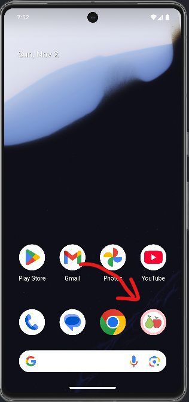
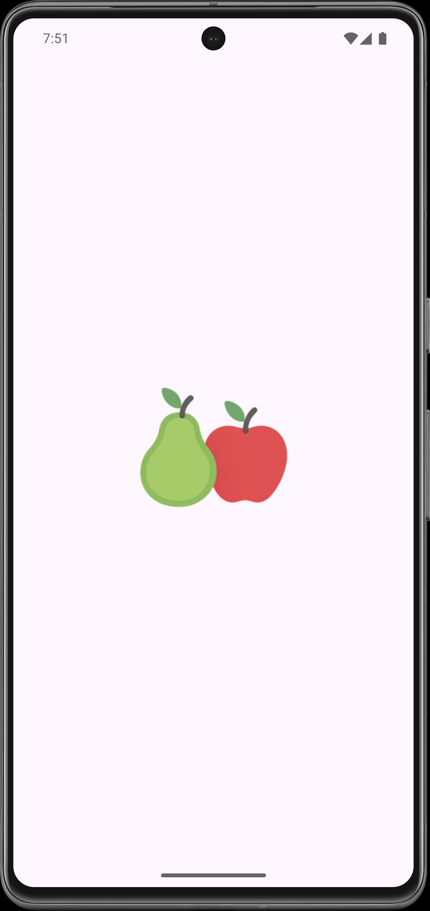
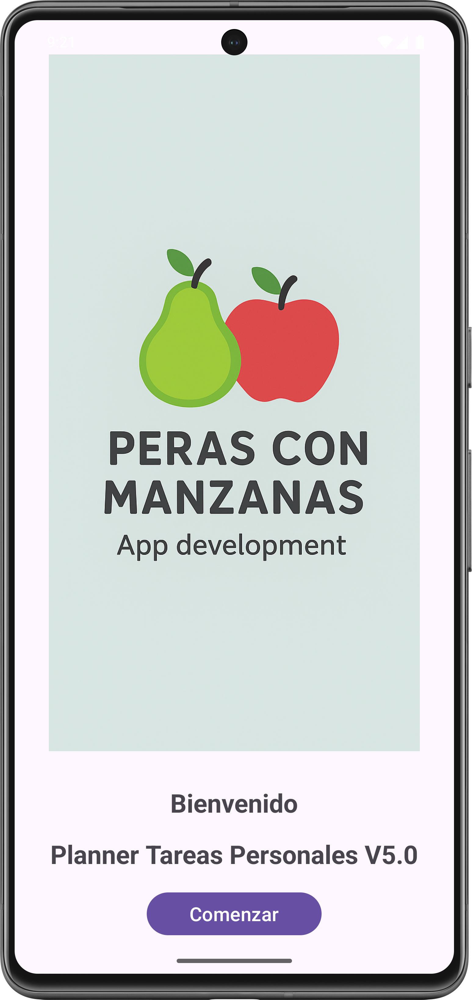
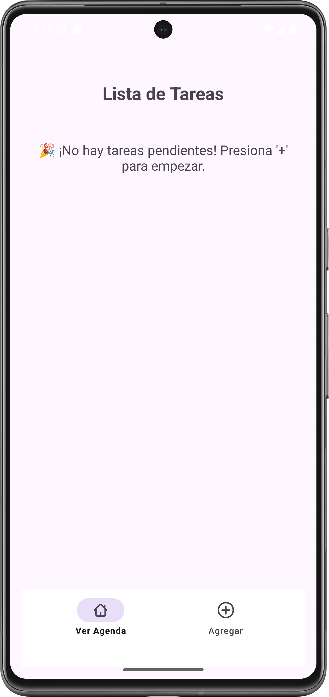
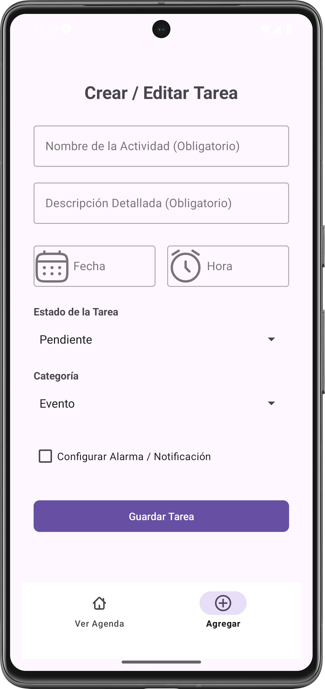
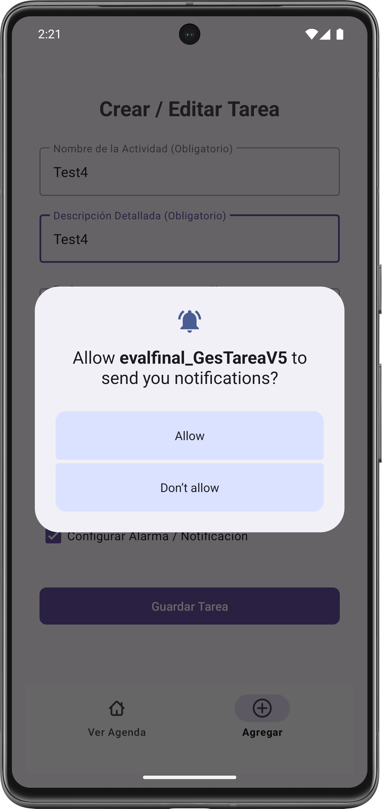
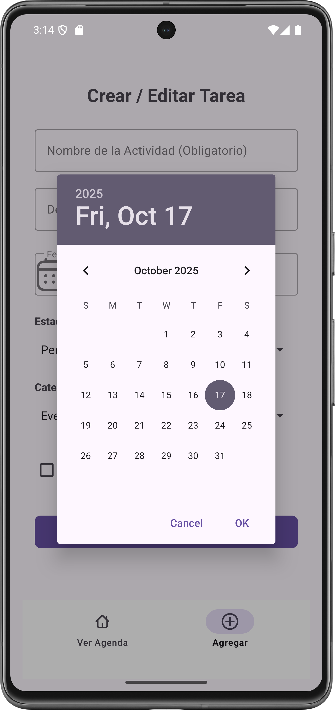
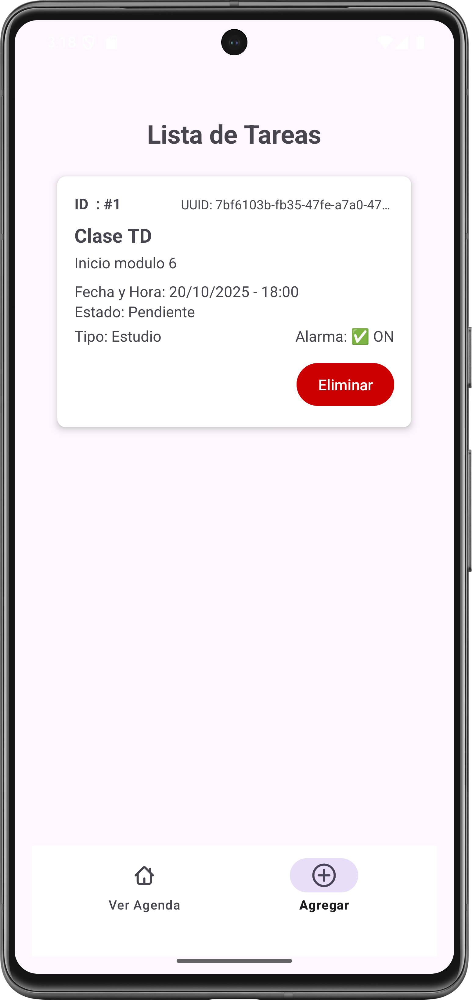
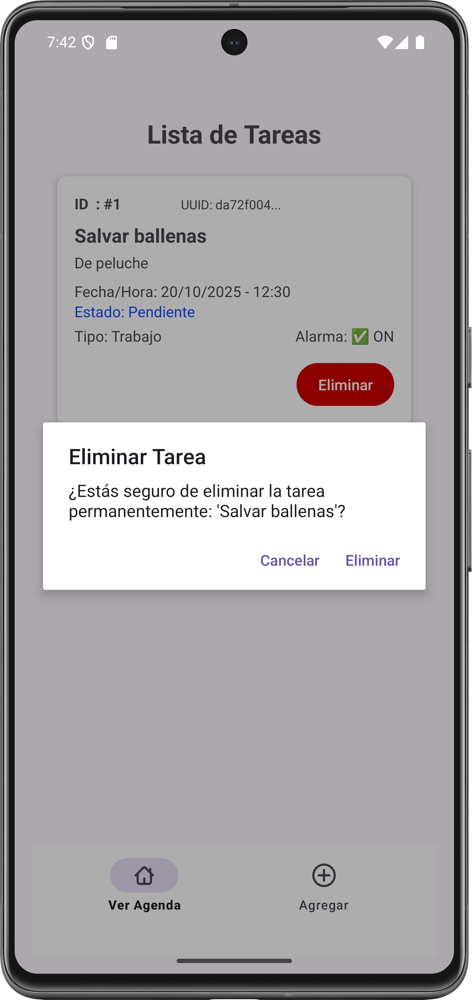

# 🚀 EVALUACIÓN FINAL MÓDULO 5: GESTOR DE TAREAS V5 - APLICACIÓN DE PATRONES DE DISEÑO ESCALABLES - ARQUITECTURA MVVM Y PERSISTENCIA

<p float="center">
  
</p>

Este proyecto es una aplicación muy sencilla y nativa para Android, desarrollada en Kotlin que, desde su version 1.0, ha sido evolucionada arquitectónicamente, junto con el desarrollo del curso, hasta adoptar complementamente el patrón _**Model-View-ViewModel (MVVM), arquitectura limpia y otras mejores prácticas**_. El principal logro en esta nueva entrega, es la implementación de un flujo de datos completamente reactivo y estable, resolviendo problemas de concurrencia y persistencia mediante la refactorización de componentes y un uso más riguroso de Jetpack LiveData y Kotlin Coroutines.

La presente versión 5.0, representa un esfuerzo por aplicar técnicas de refactorización, mantenimiento evolutivo y estabilización del proyecto, reutilizando la capa de persistencia local (archivo "tareas.csv") y la lógica de negocio para una clara separación de responsabilidades, garantizando la persistencia, el cambio de estado y la correcta gestión de permisos.

**Nota**: Se reutiliza, como base funcional, el Caso AE3-ABP1 GesTarea V3.0 (**https://github.com/jcordovaj/ae3_abp1_GesTareaV3.git**).

---

## 🎯 Requerimientos de Funcionalidad y su Implementación

| Requerimiento                          | Implementación en V5                                                                                                                                                                                                                |
| -------------------------------------- | ----------------------------------------------------------------------------------------------------------------------------------------------------------------------------------------------------------------------------------- |
| 1. Registro de Actividades             | El `CrearTareaFragment `aloja el formulario de registro.                                                                                                                                                                            |
| 2. Listado Dinámico                    | El `VerTareasFragment ` usa un **`RecyclerView`** con **`TaskAdapter`** . La actualización es **reactiva** a través de la observación de `TaskViewModel.allTasks` (LiveData)                                                        |
| 3. Uso de Fragments                    | Se implementan `VerTareasFragment `(listado) y **`CrearTareaFragment`** (registro/edición). Ambos utilizan **métodos factoría (`newInstance`)** para su creación y el paso seguro de parámetros vía **`Bundle`** (para la edición). |
| 4. Manejo del Ciclo de Vida y Permisos | La gestión de permisos sensibles (Notificaciones) se maneja en `CrearTareaFragment `mediante `registerForActivityResult` .  La persistencia se realiza de forma segura fuera del hilo principal para no bloquear la UI              |
| 5. Implementación MVVM                 | Separación estricta en las capas**Model** , **View** y **ViewModel** , utilizando **`LiveData`** para la comunicación reactiva.                                                                                                     |
| 6. Programación Asíncrona              | Uso de `Kotlin Coroutines ` y `viewModelScope `en el ViewModel para simular y ejecutar operaciones pesadas de I/O (`TaskRepository`).                                                                                               |
| 7. Manejo de Intents y Bundles         | La navegación de edición (`MainActivity.startTaskEdit`) usa un **`Bundle`** para pasar los datos de la tarea del `TaskAdapter` al `CrearTareaFragment`.                                                                             |

---

## 🧠 Requerimientos Técnicos y Arquitectura MVVM

Este proyecto, se diferencia del anterior, en que se adhiere más rigurosamete a la arquitectura MVVM, la cual resuelve la funcionalidad requerida de forma levemente diferente, pero que la hace más estable a cambios en escalabilidad y cualquier problema derivado de la actualización de la UI y el manejo de corrutinas:

1. Modelo (Model) y Persistencia

   - **Modelo de Datos (`Task.kt`)**: Es la clase de datos que define la estructura de una tarea.
   - **Repositorio (TaskRepository)**: Centraliza el acceso a los datos en el directorio `getExternalFilesDir(null)`. Es responsable de la persistencia local (`tareas.csv`) y ejecuta todas las operaciones de I/O de forma asíncrona.
   - **Repositorio (`TaskRepository.kt`):**

     - Centraliza el acceso a los datos (CSV).
     - Es responsable de la **limpieza defensiva** de la línea CSV durante la lectura, garantizando el _parsing_ correcto de los datos antiguos y nuevos.
     - Todas las operaciones de I/O se ejecutan de forma asíncrona dentro de `withContext(Dispatchers.IO)`.

2. ViewModel (`TaskViewModel.kt`)

   - Hereda de `AndroidViewModel`.
   - Utiliza **`viewModelScope.launch`** y **`withContext(Dispatchers.IO)`** para ejecutar operaciones como `readAllTasks()`, asegurando que la interfaz nunca se bloquee.
   - Mantiene la **lógica de negocio** (ordenamiento por fecha y filtrado por estado 'Pendiente').
   - Expone el estado de la aplicación a la Vista a través de **`LiveData`** :
     - `allTasks`: Lista de tareas **filtrada y ordenada** , que actualiza el `RecyclerView`.
     - `taskSavedEvent`: **`LiveData` de evento único** utilizado para notificar a `CrearTareaFragment` del éxito del guardado/actualización y disparar la navegación y la limpieza del formulario.
     - `statusMessage`: Usado para feedback de errores o validaciones.

3. Vista (View)

   - **`MainActivity`:** Contenedor y orquestador de la navegación. Al lanzar la app, el usuario, primero interactúa con un Splash de bienvenida.
   - **`VerTareasFragment`:** **Solo observa** `taskViewModel.allTasks` y usa `TaskAdapter.updateTasks()` para actualizar el `RecyclerView` de forma reactiva. La carga inicial se fuerza en `onStart()`.
   - **`CrearTareaFragment`:**
     - **Observa** `taskViewModel.taskSavedEvent` para limpiar el formulario y navegar al finalizar el guardado.
     - Contiene la lógica de manejo de **`DatePickerDialog`** y **`TimePickerDialog`** .

4. Otros aspectos técnicos

   - Se notifican los cambios de estado con Toasts.
   - Se maneja la recreación de la Activity ante cambios de configuración (rotación de pantalla).
   - Se crean y añaden los Fragments de forma dinámica usando método de factoría (newInstance).
   - Permisos Sensibles: Se gestiona la solicitud de permisos de **"Notificaciones"** (POST_NOTIFICATIONS), se integra en el flujo de grabación de tareas mediante registerForActivityResult.
   - Implementa un Adapter personalizado para el RecyclerView.
   - Uso de bundle para pasar datos (ej. al Fragment de edición de una tarea).

## ✨ Reactividad y Persistencia

### 1. Registro de Actividades (CrearTareaFragment)

- El formulario permite registrar (o editar) todos los campos (`Título`, `Descripción`, `Fecha`, `Hora`, `Estado`, `Categoría`, `Alarma`).
- La **validación simple de datos faltantes** se realiza antes de llamar al ViewModel.
- Al presionar "Guardar", se llama a `taskViewModel.saveOrUpdateTask()`. Este método ejecuta la persistencia en `Dispatchers.IO` y, al regresar, actualiza el `taskSavedEvent` (LiveData), que a su vez desencadena:

  - La **limpieza del formulario** (`resetFormFields()`).
  - La **navegación** a la lista de tareas.
  - La **recarga completa** de la lista (`loadTasks()`) para actualizar los datos en el fondo.

### 2. Listado Dinámico de Actividades (VerTareasFragment)

- El `VerTareasFragment` llama a `taskViewModel.loadTasks()` en `onStart()`.
- `loadTasks()` lee los datos, los filtra y los ordena en un hilo de fondo.
- El resultado se publica en `taskViewModel.allTasks` (LiveData).
- El observador en la Vista reacciona a este cambio, llamando a **`taskAdapter.updateTasks(tasks)`** , lo que fuerza al **`RecyclerView`** a redibujarse automáticamente con la lista actualizada.

### 3. Gestión de Permisos Sensibles

- El permiso de **Notificaciones (`POST_NOTIFICATIONS`)** solo se solicita si el usuario marca la casilla de alarma y el SDK es `TIRAMISU` o superior.
- La solicitud se maneja de forma asíncrona y segura utilizando el contrato **`ActivityResultContracts.RequestPermission()`** en `CrearTareaFragment`.

## 🛠️ Tecnologías usadas

- IDE: Android Studio (Narwhal 3, basado en IntelliJ IDEA)
- Plataforma: Android Nativo
- SDK mínimo: 29
- SDK Target: 36
- Kotlin: 1.9.22
- Java: 21
- Arquitectura: MVVM (Model-View-ViewModel).
- Concurrencia: Kotlin Coroutines y viewModelScope (`viewModelScope`, `Dispatchers.IO`).
- **Comunicación**LiveData (Reactividad)**UI/Vistas**Activity, Fragment, `RecyclerView`, `TaskAdapter`
- UI/Navegación: Activity, Fragment y BottomNavigationView (Ver Agenda, Agregar)
- Almacenamiento: Archivos CSV (ubicados en getExternalFilesDir(null), en el dispositivo)
- **Manejo de Permisos** `registerForActivityResult` (Modern Android API)
- APIs de Sistema: AlarmManager, CalendarContract (Calendar Provider).
- Otras tecnologías: Git, Github, Github Desktop.

---

## 💾 Estructura de Datos (CSV)

El archivo tareas.csv se compone de 8 atributos, con la siguiente estructura:

| Campo       | Descripción                                                             | Tipo de Dato |
| ----------- | ----------------------------------------------------------------------- | ------------ |
| ID          | UUID                                                                    | String       |
| Título      | Título de la actividad                                                  | String       |
| Descripción | Breve descripción                                                       | String       |
| Estado      | Estado actual (Pendiente, Completada, Eliminada)                        | String       |
| Fecha       | Fecha programada                                                        | String       |
| Hora        | Hora programada                                                         | String       |
| Categoría   | Clasificación del registro (Evento, recordatorio, Tarea, Estudio, etc.) | String       |
| Alarma      | Switch que activa o desactiva alarma recordatorio (boolean)             | String       |

## 🏗️ Funcionamiento de la Aplicación

El flujo base es el siguiente:

1. Inicio y Navegación: La aplicación muestra la pantalla de bienvenida y luego la MainActivity orquesta la navegación a través de la BottomNavigationView entre VerTareasFragment (Ver Agenda) y CrearTareaFragment (Agregar).
2. Vista Agenda (VerTareasFragment):
   - Observa el taskViewModel.allTasks (LiveData).
   - Cuando el ViewModel actualiza esta lista, el RecyclerView se redibuja automáticamente (reactividad).
   - Maneja la acción de eliminar o marcar como completada, llamando a los métodos correspondientes en el ViewModel.
3. Crear/Editar Evento (CrearTareaFragment):
   - El usuario ingresa o edita los datos.
   - Al presionar "Guardar" o "Actualizar":
     - Se realiza la validación de campos obligatorios.
     - Si se requiere alarma (Notificación), se verifica/solicita el permiso de Notificaciones (POST_NOTIFICATIONS) usando registerForActivityResult.
     - Se llama a taskViewModel.saveOrUpdateTask(), que ejecuta la lógica de persistencia en el TaskRepository fuera del hilo principal.
     - La vista (Fragment) observa el taskViewModel.statusMessage para mostrar un Toast de confirmación de forma segura.
     - Finalmente, la vista navega de vuelta a la Agenda.
4. Las tareas listadas, se puede seleccionar para ser editadas.
5. Cada tarea tiene un botón eliminar que permite proceder al borrado explícito, debiendo confirmar la acción.

## Capturas de Pantalla

<table width="100%">
    <tr>
        <td align="center" width="33%">
            
        </td>
        <td align="center" width="33%">
            
        </td>
        <td align="center" width="33%">
            
        </td>
    </tr>
    <tr>
        <td align="center">App instalada</td>
        <td align="center">Al lanzar la App</td>
        <td align="center">Splash bienvenida</td>
    </tr>
    <tr>
        <td align="center">
            
        </td>
        <td align="center">
            
        </td>
        <td align="center">
            
        </td>
    </tr>
    <tr>
        <td align="center">Pantalla Inicial Sin Datos</td>
        <td align="center">Fragmento Crear/Editar Tarea</td>
        <td align="center">Autorización para Notificaciones</td>
    </tr>
    <tr>
        <td align="center">
            
        </td>
        <td align="center">
            
        </td>
        <td align="center">
            
        </td>
    </tr>
    <tr>
        <td align="center">Picker de Fecha</td>
        <td align="center">Picker de Hora</td>
        <td align="center">Selector de Estado</td>
    </tr>
    <tr>
        <td align="center" width="33%">
            
        </td>
        <td align="center" width="33%">
            
        </td>
        <td align="center" width="33%">
            
        </td>
    </tr>
    <tr>
        <td align="center">Selector de categoría</td>
        <td align="center">Tarea creada</td>
        <td align="center">Eliminar Tarea</td>
    </tr>
</table>

Diagrama

graph LR
subgraph Vista (UI - Main Thread)
V[Fragments: VerTareas / CrearTarea]
end

    subgraph ViewModel (Logic - Main Thread)
        VM[TaskViewModel]
    end

    subgraph Modelo (Data - I/O Thread)
        R[TaskRepository]
        D[(Archivo CSV)]
    end

    V -- 1. Inicia Acción (loadTasks / save) --> VM

    VM -- 2. Lanza Coroutine (viewModelScope) --> VM
    VM -- 3. Pide Datos/Persistencia --> R

    R -- 4. Ejecuta I/O (Dispatchers.IO) --> D
    D -- 5. Retorna Datos Limpios --> R

    R -- 6. Retorno de Coroutine --> VM

    VM -- 7. Publica el Resultado (allTasks / taskSavedEvent) --> L(LiveData<T>)

    L -- 8. Observa Cambio (Reactividad) --> V

## Guía de Ejecución del Proyecto

**Para ejecutar este proyecto en tu entorno de desarrollo, siga estos 'quick steps':**

1.**Clonar el Repo:** Clona el proyecto en su máquina local.

2.**Abrir en Android Studio:** Abra la carpeta del proyecto con Android Studio. El IDE detectará automáticamente la configuración de Gradle.

3.**Sincronizar Gradle:** Haz clic en el botón "Sync Now" si Android Studio te lo solicita. Esto descargará todas las dependencias necesarias.

4.**Ejecutar:** Conecta un dispositivo Android físico o inicia un emulador. Luego, haz clic en el botón "Run 'app'" (el ícono de la flecha verde) para desplegar la aplicación.

**Para ejecutar este proyecto en tu celular, sigue estos 'quick steps':**

1.**Copiar la APK:** Copia la aplicación (APK) en tu celular.

2.**Instalar:** Instala la aplicación, salta los avisos de advertencia, es normal si la aplicación no ha sido productivizada la plataforma de Android.

3.**Abrir la App:** Haz doble clic en el ícono "Agenda".

4.**Recorrer las opciones:** Cliquea en las opciones y podrás acceder al listado de eventos, editar cada evento, crear nuevos eventos, regresando a cualquier punto de la app.

## Instalación y Configuración

a. **Clonar el repositorio:**

    ```bash

https://github.com/jcordovaj/evalfinal_GesTareaV5.git

    ```

b. **Abrir el Proyecto en Android Studio:**

b.1. Abrir Android Studio.

b.2. En la pantalla de bienvenida, seleccionar **"Open an existing Android Studio project"** (Abrir un proyecto de Android Studio existente).

b.3. Navegar a la carpeta donde se clonó el repositorio y seleccionarla. Android Studio detectará automáticamente el proyecto de Gradle y comenzará a indexar los archivos.

c. **Sincronizar Gradle:**

c.1. Este es el paso más importante. Después de abrir el proyecto, Android Studio intentará sincronizar la configuración de Gradle. Esto significa que descargará todas las librerías, dependencias y plugins necesarios para construir la aplicación. Normalmente, una barra de progreso se mostrará en la parte inferior de la consola de Android Studio con un mensaje como **"Gradle Sync in progress"**.

c.2. Si no se inicia, o si el proceso falla, intente con el botón **"Sync Project with Gradle Files"** en la barra de herramientas. Es el icono con el **"elefante" de Gradle**. Eso forzará la sincronización.

c.3. Esperar que el proceso de sincronización termine. De haber errores, puede ser por problemas en la configuración de Android u otros conflictos, la aplicación debe descargar lo que requiera y poder ser ejecutada "AS-IS".

d. **Configurar el Dispositivo o Emulador:**

Para ejecutar la aplicación, se requiere un dispositivo Android, puedes usarse el emulador virtual o un dispositivo físico.

d.1. Emulador: En la barra de herramientas, haga click en el botón del "AVD Manager" (Android Virtual Device Manager), que es el icono de un teléfono móvil con el logo de Android. Desde ahí, puedes crear un nuevo emulador con la versión de Android que prefiera (Nota: Debe considerar que cada celular emulado, puede requerir más de 1GB de espacio en disco y recursos de memoria).

d.2. Dispositivo físico: Conecte su teléfono Android a la computadora con un cable USB (también puede ser por WI-FI). Asegúrese de que las **Opciones de desarrollador y la Depuración por USB** estén habilitadas en su dispositivo. Consulte a su fabricante para activar estas opciones.

e. **Ejecutar la aplicación:**

e.1. Seleccione el dispositivo o emulador deseado en la barra de herramientas del emulador.

e.2. Haga click en el botón "Run 'app'" (el triángulo verde en la parte superior, o vaya al menu "RUN") para iniciar la compilación y el despliegue de la aplicación, puede tardar algunos minutos, dependiendo de su computador.

e.3. Si todo ha sido configurado correctamente, la aplicación se instalará en el dispositivo y se iniciará automáticamente, mostrando la pantalla de inicio.

## Contribuciones (Things-To-Do)

Se puede contribuir reportando problemas o con nuevas ideas, por favor respetar el estilo de programación y no subir código basura. Puede utilizar: forking del repositorio, crear pull requests, etc. Toda contribución es bienvenida.

## Licencia

Proyecto con fines educativos, Licencia MIT
